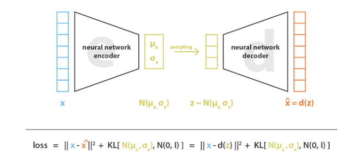

# VAE_from_scratch

## Introduction

Pytorch版本实现的Variational Autoencoder(仅供学习)

## Preliminary

- **VAE-architecture**

- **公式推导**

    见 [VAE理论知识推导](/notebook/VAE.pdf)

## Acknowledgements

- [变分自编码器VAE详解](https://mp.weixin.qq.com/s/PN5LnQHrk7hZz79P0fT26Q)
- [抛开数学轻松学懂VAE(附PyTorch实现)](https://zhouyifan.net/2022/12/19/20221016-VAE/)
- [ 变分自编码器:原来是这么一回事](https://kexue.fm/archives/5253)
- [Variational Autoencoders](https://amaires.github.io/VAE/)
- [Understanding Variational Autoencoders (VAEs)](https://towardsdatascience.com/understanding-variational-autoencoders-vaes-f70510919f73)
